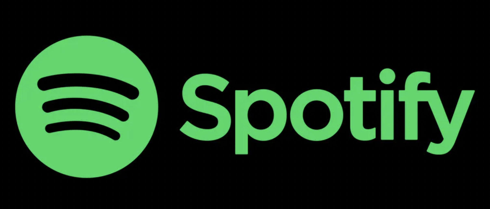
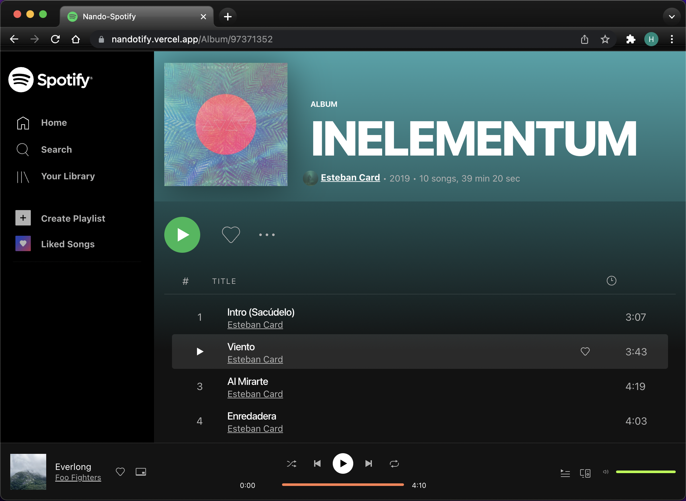
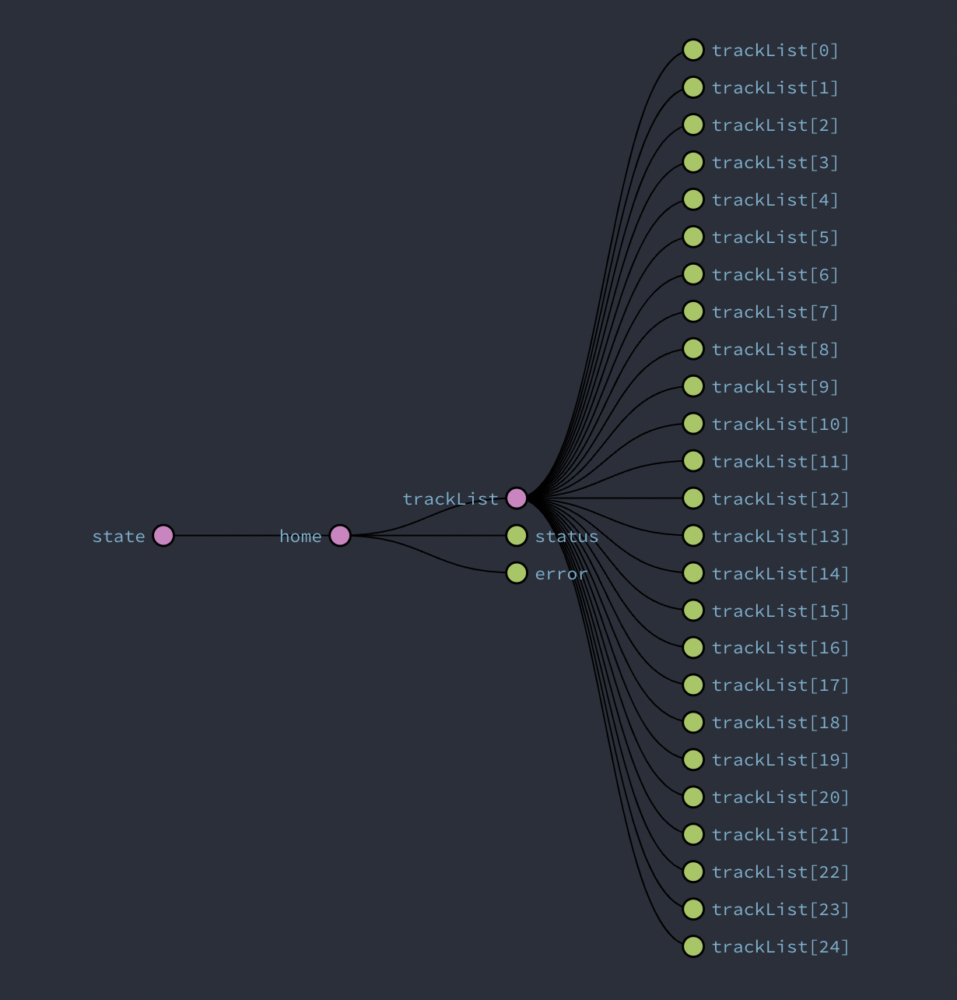
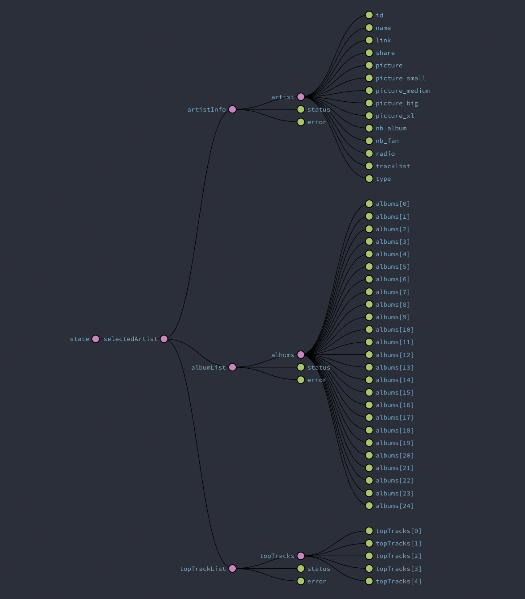
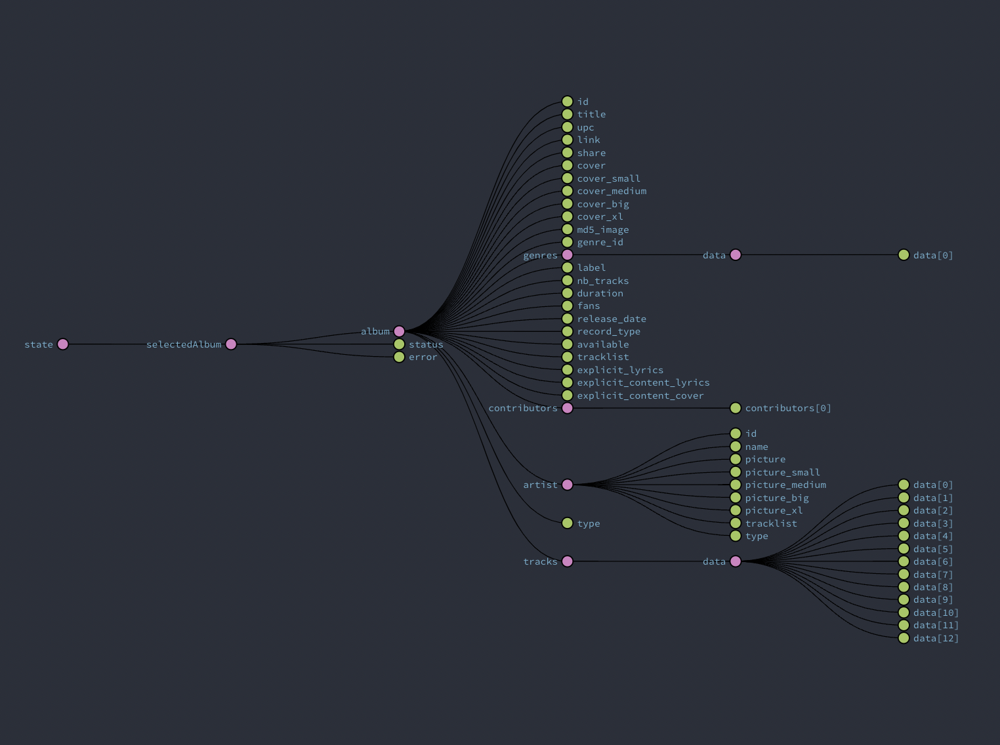
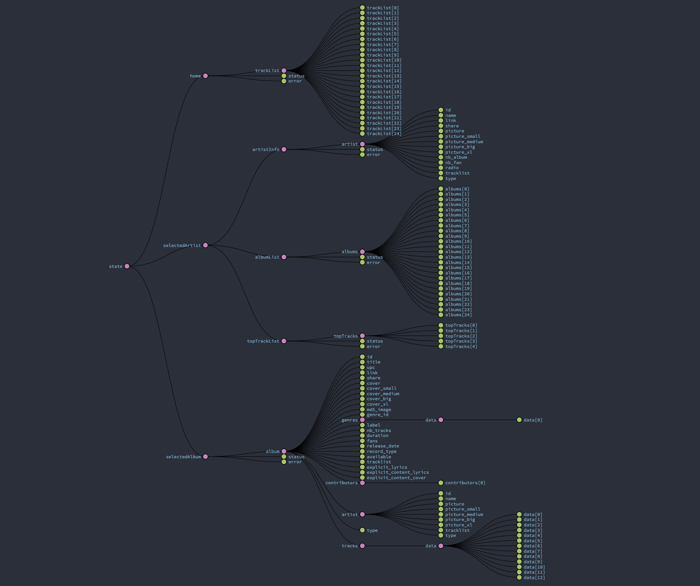
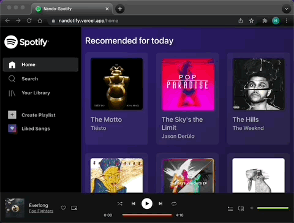
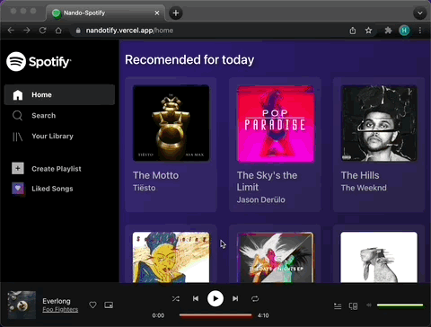
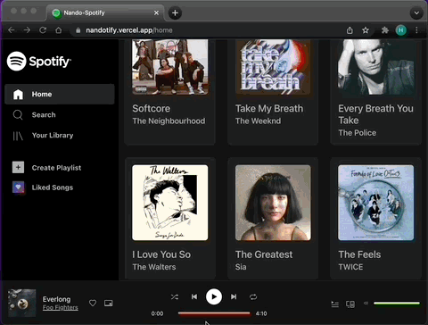

<!-- PROJECT LOGO -->
 

  

<h3 align="center">Spotify - Clone  -> [Front-End]</h3>

  

    A project that clones Spotify, developed during Strive School's Full Stack program!
     
     
    <a href="https://nandotify.vercel.app/">View Demo</a>
    <!-- ·
    <a href="https://github.com/Nando-C/Buildweek2/issues">Report Bug</a> -->
  

<!-- TABLE OF CONTENTS -->

  
Table of Contents

  <ol>
    <li>
      <a href="#about-the-project">About The Project</a>
      <ul>
        <li><a href="#built-with">Built With</a></li>
        <li><a href="#redux-store">Redux Store</a>
      </ul>
    </li>
    <li><a href="#app-use">App Use</a>
     <ul>
        <li><a href="#home">Home</a></li>
        <li><a href="#search">Search</a></li>
      </ul>
    </li>
    <li><a href="#player">Player</a></li>
    <li><a href="#contact">Contact</a></li>
  </ol>

<!-- ABOUT THE PROJECT -->

## About The Project

A Spotify clone project to put in practise our Front-End skills, as part of the Full Stack Master Camp at Strive School. This was my first real world project, started during the first modules of the program, but then I decided to create this new repo and built it again from scratch, as I have a much better understanding of the technologies and code practises.

All the information is retrieved from the dezzer API.

(<a href="#top">back to top</a>)

### Built With

- [Node.js](https://nodejs.org/)
- [React.js](https://reactjs.org/)
- [Bootstrap](https://getbootstrap.com)
- [Redux](https://redux.js.org/)

(<a href="#top">back to top</a>)

### Redux Store

Part of the objectives for this project was to consolidate my knowledge using Redux and Redux Tool Kit. So I created three Redux slices to handle the state on this project.

- Home

    

- Artist

    

- Album

    

- A full picture of the state

    

I did not see the point of including the search page information in the redux store, so this is managed on the component's local state.

(<a href="#top">back to top</a>)

<!-- USAGE EXAMPLES -->

## App Use

The work flow of this application is similar to the real spotify. However, not all features have been implemented, yet.

### Home

- Home is the landing page, you will start from here, where you have some recomendations of the day.
- By clicking on the album cover or the song title, you will be directed to the album page.

    

- Otherwise, clicking on the artist name will take you to the artist page.

    

(<a href="#top">back to top</a>)

### Search

- Go to the search page by clicking on the search option on the navigation bar.
- Here you have a pre-selection of "trending" tracks.
- To perform a search, start typing the name of your favorite song or artist on the search box.

    

- Once you have found what you are looking for, access the content in the same way as in the home page.

(<a href="#top">back to top</a>)

<!-- CONTACT -->

## Player

The option to play any available track (or a sample of it, to be more precise) will be available in the next release. 🛠 Watch this space! 👀

(<a href="#top">back to top</a>)

## Contact

[@Nando](https://hernando-crespo.vercel.app/) - Get in touch and let me know what do you think of this project! 😉

(<a href="#top">back to top</a>)

