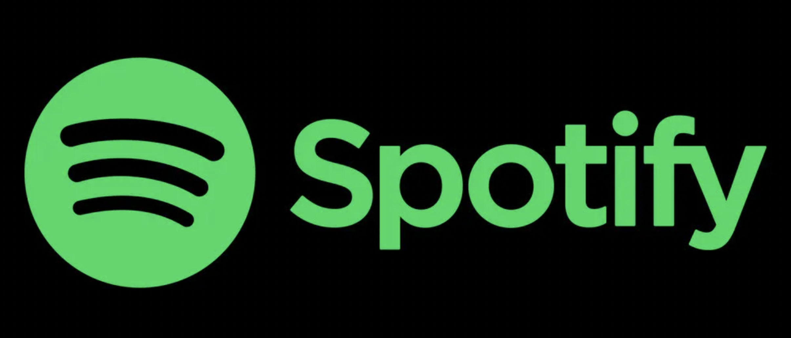
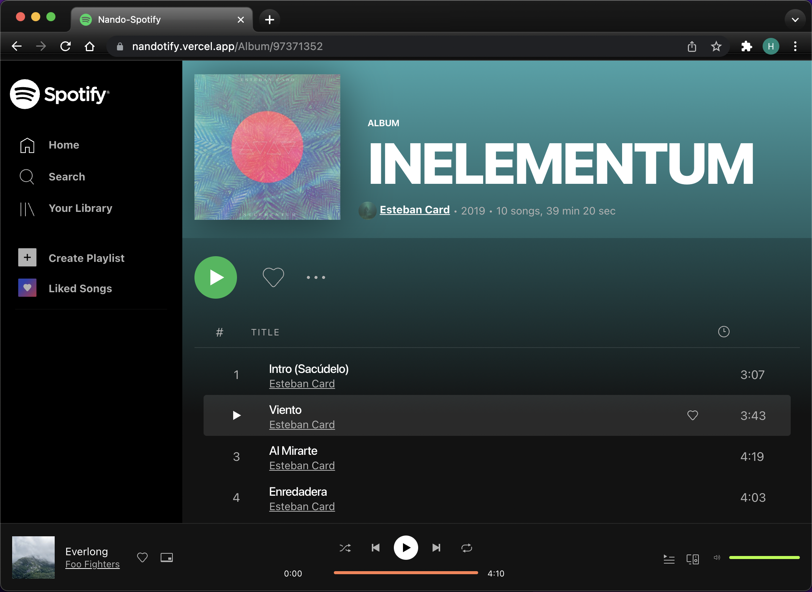

<!-- PROJECT LOGO -->
 

  

<h3 align="center">Spotify - Clone  -> [Front-End]</h3>

  

    A project that clones Spotify, developed during Strive School's Full Stack program!
     
     
    <a href="https://nandotify.vercel.app/">View Demo</a>
    <!-- ·
    <a href="https://github.com/Nando-C/Buildweek2/issues">Report Bug</a> -->
  

<!-- TABLE OF CONTENTS -->

  
Table of Contents

  <ol>
    <li>
      <a href="#about-the-project">About The Project</a>
      <ul>
        <li><a href="#built-with">Built With</a></li>
      </ul>
    </li>
    <li><a href="#usage">Usage</a>
     <ul>
        <li><a href="#">feature</a></li>
      </ul>
    </li>
    <li><a href="#contact">Contact</a></li>
  </ol>

<!-- ABOUT THE PROJECT -->

## About The Project

This is the Front-End for a Spotify clone project. Started as part of the Full Stack Master Camp at Strive School on another repo, during the first modules (one of my first real world projects), but then I decided to create this new repo and built it again from scratch, as I have a much better understanding of the technologies and code practises.

All the information is retrieved from the dezzer API.

(<a href="#top">back to top</a>)

### Built With

- [Node.js](https://nodejs.org/)
- [React.js](https://reactjs.org/)
- [Bootstrap](https://getbootstrap.com)
- [Redux](https://redux.js.org/)

(<a href="#top">back to top</a>)

<!-- USAGE EXAMPLES -->

## App Usage

The work flow of this application is similar to the real spotify

### Home

When the app is openend you will land in the home page.
Here you have some recomendations of the day.
By clicking on the album cover or the song title, you will be directed to the album page.

Otherwise, clicking on the artist name will take you to the artist page.

(<a href="#top">back to top</a>)

### Search

Go to the search page by clicking on the search option on the navigation bar.
Here you have a preselection of "trending" tracks.
To perform a search, start typing the name of your favorite song or artist on the search box.

(<a href="#top">back to top</a>)

<!-- CONTACT -->

## Contact

[@Nando](https://hernando-crespo.vercel.app/) - Get in touch and let me know what do you think of this project! 😉

(<a href="#top">back to top</a>)

